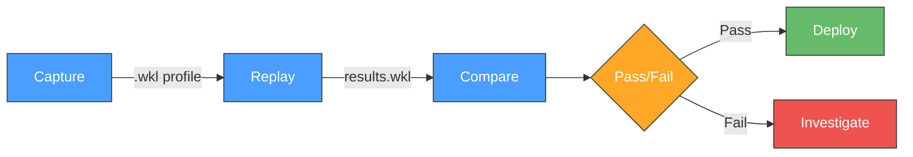
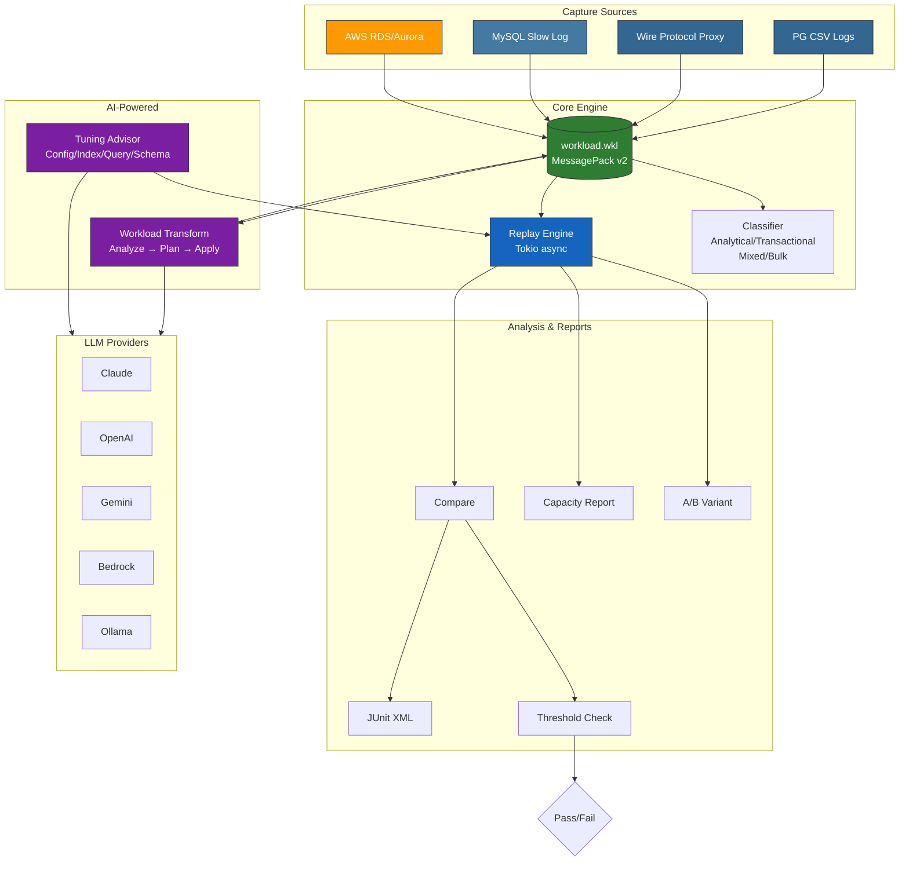
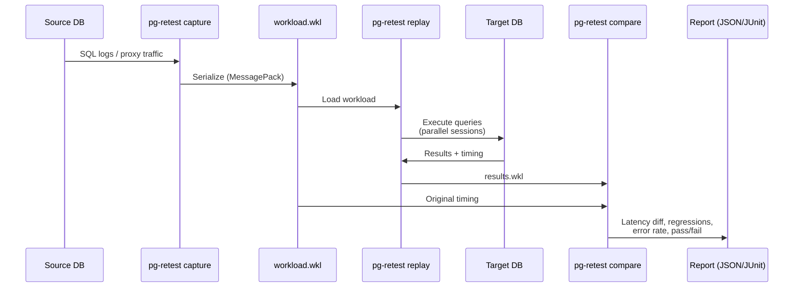
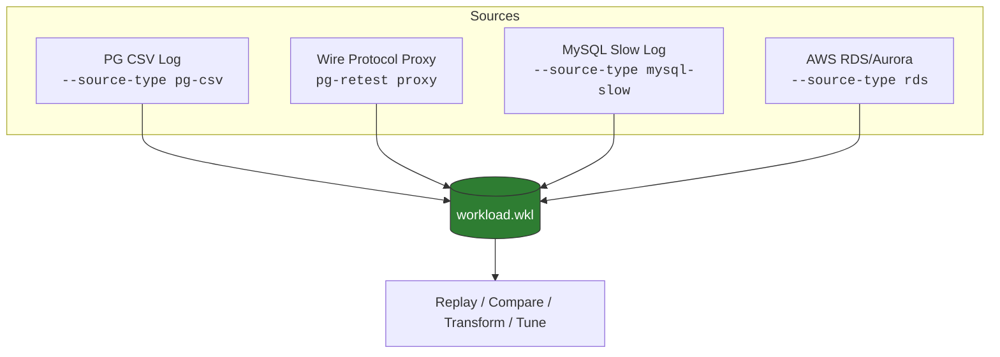
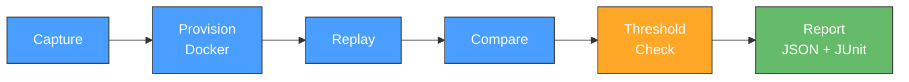
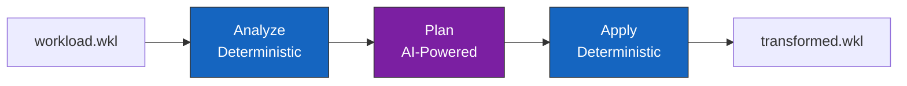
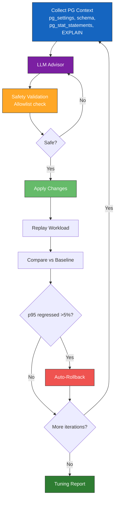

# pg-retest


Capture, replay, and compare PostgreSQL workloads. Validate configuration changes, server migrations, capacity planning, and cross-database migrations with confidence.

> **Important:** pg-retest is a workload simulation tool, not a replication system. Replay produces a high-fidelity approximation of your production traffic (93-96% accuracy for write workloads with `--id-mode=full`, near-100% for read-only), but it is **not** guaranteed to produce byte-identical results. The 4-7% error rate in write workloads comes from concurrent session sequence ordering — the same fundamental limitation Oracle RAT documents as "replay divergence." Use pg-retest to answer "will my workload perform the same on the new target?" — not "will my data be identical." See [Replay Accuracy & Fidelity](docs/replay-accuracy.md) for detailed benchmarks and per-mode analysis.

---

## Why pg-retest?

| | |
|---|---|
| **🔄 Pre-Migration Validation** | Replay production traffic against your new datacenter, hardware, or cloud target before cutting over. Know it works — don't hope. |
| **⬆️ Version & Patch Testing** | Upgrading PostgreSQL 15 → 16? Replay your exact workload against the new version and catch regressions before they hit production. |
| **⚙️ Configuration Benchmarking** | Changed `shared_buffers` or `work_mem`? Compare before and after with real queries, not synthetic benchmarks. |
| **☁️ Cloud Provider Evaluation** | RDS vs. Aurora vs. AlloyDB vs. self-hosted — replay identical traffic against each and let the numbers decide. |
| **📈 Capacity Planning** | Scale your workload 2x, 5x, 10x to find where things break — before Black Friday finds it for you. |
| **🚦 CI/CD Regression Gates** | Automated pass/fail on every schema migration or config change. Catch performance regressions in the pipeline, not in production. |
| **🔀 Cross-Database Migration** | Moving from MySQL to PostgreSQL? Capture your MySQL workload, transform the SQL, and validate it runs correctly on PG. |
| **🤖 AI-Assisted Optimization** | Get LLM-powered tuning recommendations — then validate every change against your real workload with automatic rollback on regression. |



---

## Quick Start

### Try with Docker

No Rust toolchain needed — just Docker.

```bash
git clone https://github.com/pg-retest/pg-retest.git
cd pg-retest

# Build and start the demo (first build takes ~5 minutes)
docker compose up --build

# Open http://localhost:8080 — click "Demo" in the sidebar
```

The demo environment includes two PostgreSQL 16 databases seeded with a 94k-row e-commerce dataset and a pre-built workload with 357 queries across 8 concurrent sessions. The Demo page provides a guided wizard that walks you through the full workflow — inspect, replay, compare, scale, and AI-assisted tuning — plus scenario cards for quick exploration of migration testing, capacity planning, and A/B comparisons.

```bash
# Tear down when done:
docker compose down -v
```

**Troubleshooting: Port conflicts**

If `docker compose up` fails with "port already allocated", override the default ports:

```bash
PG_RETEST_WEB_PORT=9090 PG_RETEST_DB_A_PORT=5460 PG_RETEST_DB_B_PORT=5461 docker compose up -d
```

See the [Demo Environment Guide](docs/demo.md) for full details, CLI examples, and troubleshooting.

### Prerequisites

- **Rust** toolchain (1.70+): [Install via rustup](https://rustup.rs/)
- **PostgreSQL** target database for replay
- *Optional:* `aws` CLI (for RDS capture), Docker (for CI/CD provisioning)

### Install & Build

```bash
git clone https://github.com/pg-retest/pg-retest.git
cd pg-retest
cargo build --release

# Binary is at ./target/release/pg-retest
# Optionally copy to your PATH:
cp target/release/pg-retest /usr/local/bin/
```

### 3-Step Workflow

```bash
# Step 1: Capture workload from PostgreSQL CSV logs
pg-retest capture \
  --source-log /path/to/postgresql.csv \
  --output workload.wkl

# Step 2: Replay against a target database
pg-retest replay \
  --workload workload.wkl \
  --target "host=localhost dbname=mydb user=postgres" \
  --output results.wkl

# Step 3: Compare and get a report
pg-retest compare \
  --source workload.wkl \
  --replay results.wkl \
  --json report.json \
  --fail-on-regression
```

> **Tip:** For write workloads, add `--id-mode=full` to handle database-generated ID divergence. See [ID Correlation](docs/id-correlation.md) for details.

### Other Quick Commands

```bash
# Inspect a workload profile
pg-retest inspect workload.wkl

# Inspect with classification breakdown
pg-retest inspect workload.wkl --classify

# Launch the web dashboard
pg-retest web --port 8080

# Run a full CI/CD pipeline from config
pg-retest run --config .pg-retest.toml

# AI-assisted tuning (dry-run by default)
pg-retest tune \
  --workload workload.wkl \
  --target "host=localhost dbname=mydb user=postgres" \
  --provider claude
```

---

## Architecture



### Data Flow



---

## Features

| Feature | Description |
|---------|-------------|
| **Multi-source capture** | PG CSV logs, wire protocol proxy, MySQL slow logs, AWS RDS/Aurora |
| **Transaction-aware replay** | BEGIN/COMMIT/ROLLBACK boundaries, auto-rollback on failure |
| **Read-only mode** | Strip DML for safe replay against production replicas |
| **Speed control** | Compress or stretch inter-query timing (0.1x to 10x) |
| **Scaled benchmark** | Duplicate sessions Nx with staggered offsets |
| **Per-category scaling** | Scale Analytical, Transactional, Mixed, Bulk independently |
| **PII masking** | Strip string/numeric literals from SQL (`--mask-values`) |
| **Comparison reports** | Per-query latency regression detection with thresholds |
| **A/B variant testing** | Compare performance across database targets |
| **CI/CD pipeline** | TOML config, Docker provisioning, JUnit XML, exit codes |
| **Cross-DB capture** | MySQL slow log capture with automatic SQL transform |
| **Web dashboard** | 11-page SPA with real-time WebSocket updates |
| **AI workload transform** | Reshape workloads with AI (scale, inject, remove queries) |
| **AI-assisted tuning** | LLM-powered config, index, query, and schema recommendations |
| **Capacity planning** | Throughput QPS, latency percentiles, error rates at scale |
| **ID correlation** | Sequence snapshot/reset, RETURNING value capture, cross-session ID remapping |
| **Persistent proxy** | Always-on proxy with start/stop capture, SQLite staging, crash recovery |
| **Capture safeguards** | Auto-stop on query count, DB size, or duration limits |
| **Docker demo** | One-command demo with e-commerce data, guided wizard, and scenario cards |

---

## Subcommands

| Command | Description |
|---------|-------------|
| `capture` | Capture workload from PostgreSQL logs, MySQL logs, or RDS |
| `replay` | Replay a captured workload against a target database |
| `compare` | Compare source workload with replay results |
| `inspect` | Inspect a workload profile (optionally with classification) |
| `proxy` | Run a capture proxy between clients and PostgreSQL |
| `run` | Run full CI/CD pipeline from TOML config |
| `ab` | A/B test across different database targets |
| `web` | Launch the web dashboard |
| `transform` | AI-powered workload transformation (analyze/plan/apply) |
| `tune` | AI-assisted database tuning |
| `proxy-ctl` | Control a running persistent proxy (start/stop capture, recover) |
| `compile` | Compile a workload for deterministic replay (pre-resolve IDs, strip response_values) |

---

## Capture Methods

pg-retest supports four capture backends. All produce the same `.wkl` workload profile format.



### PostgreSQL CSV Log Capture

The default capture method. Parses PostgreSQL CSV log files to extract per-connection SQL streams with timing metadata.

```bash
pg-retest capture \
  --source-log /path/to/postgresql.csv \
  --output workload.wkl \
  --source-host prod-db-01 \
  --pg-version 16.2 \
  --mask-values
```

<details>
<summary><strong>PostgreSQL Logging Setup</strong></summary>

**Check current settings:**

```sql
SHOW logging_collector;              -- Must be 'on'
SHOW log_destination;                -- Must include 'csvlog'
SHOW log_min_duration_statement;     -- Check current value
```

**Configure logging** in `postgresql.conf`:

```ini
# Required: enables the log file collector process
# NOTE: changing this requires a PostgreSQL RESTART if not already 'on'
logging_collector = on

# Required: enable CSV log output
# Change takes effect after: pg_ctl reload (no restart needed)
log_destination = 'csvlog'

# Recommended: log all statements with their duration in one line
# Change takes effect after: pg_ctl reload (no restart needed)
log_min_duration_statement = 0    # logs every statement with duration

# Alternative: log statements and duration separately
# log_statement = 'all'           # logs all SQL statements
# log_duration = on               # logs duration of each statement

# Optional: useful log file naming
log_filename = 'postgresql-%Y-%m-%d.log'
log_rotation_age = 1d
```

**Which settings require a restart?**

| Setting | Restart required? | Notes |
|---------|:-:|-------|
| `log_statement = 'all'` | No | `ALTER SYSTEM` + `SELECT pg_reload_conf()` |
| `log_duration = on` | No | Reload only |
| `log_destination = 'csvlog'` | No | Reload only |
| `log_min_duration_statement = 0` | No | Reload only |
| `logging_collector = on` | **Yes** | Only if not already enabled (usually is in production) |

**Apply changes:**

If `logging_collector` was already `on`:

```bash
# No restart needed -- just reload config
pg_ctl reload -D /path/to/data
# OR from SQL:
# SELECT pg_reload_conf();
```

If `logging_collector` was `off` (requires restart):

```bash
pg_ctl restart -D /path/to/data
```

**Verify logging:**

```bash
ls -la /path/to/data/log/*.csv
# You should see files like: postgresql-2024-03-08.csv
```

**Log file locations:**

- **Default:** `$PGDATA/log/` directory
- **Custom:** Set `log_directory` in postgresql.conf
- **RDS/Aurora:** Use the `--source-type rds` capture method (see below)

**Performance impact:**

Logging with `log_min_duration_statement = 0` has minimal overhead on most workloads (typically <2% throughput impact). For extremely high-throughput systems (>50k queries/sec), consider setting `log_min_duration_statement = 1` to skip sub-millisecond queries, or capturing during off-peak windows.

</details>

### Proxy Capture

A PostgreSQL wire protocol proxy that sits between your application and database, capturing all SQL traffic with zero application changes.

```bash
pg-retest proxy \
  --listen 0.0.0.0:5433 \
  --target localhost:5432 \
  --output workload.wkl \
  --pool-size 100 \
  --mask-values
```

Point your application at the proxy (port 5433) instead of the database directly. The proxy transparently relays all traffic while capturing queries. It handles SCRAM-SHA-256 authentication, session-mode connection pooling, and buffered I/O for near-zero overhead.

Options:
- `--no-capture` -- run as a proxy without capturing (useful for testing connectivity)
- `--duration 5m` -- capture for a fixed duration, then shut down (supports `s`, `m` suffixes)
- `--mask-values` -- strip PII from captured SQL literals

Stop with Ctrl+C (SIGINT) or SIGTERM -- the proxy writes the `.wkl` file on graceful shutdown.

### Persistent Proxy Mode

Run the proxy as a long-lived service — no traffic redirection needed for each capture:

```bash
# Start persistent proxy (no capture yet)
pg-retest proxy --listen 0.0.0.0:5433 --target db:5432 --persistent

# From another terminal: start/stop captures
pg-retest proxy-ctl start-capture --proxy localhost:9091
pg-retest proxy-ctl stop-capture --proxy localhost:9091 --output workload.wkl
pg-retest proxy-ctl status --proxy localhost:9091
```

Captured queries are staged to SQLite to prevent OOM on long-running captures. Multiple sequential captures are supported without restarting the proxy. The proxy can also be controlled from the web dashboard's Proxy page.

### MySQL Slow Query Log Capture

Capture workload from MySQL slow query logs and automatically transform SQL syntax to PostgreSQL-compatible format.

```bash
pg-retest capture \
  --source-type mysql-slow \
  --source-log /path/to/mysql-slow.log \
  --output workload.wkl
```

The transform pipeline automatically converts:
- Backtick-quoted identifiers to double-quoted identifiers
- `LIMIT offset, count` to `LIMIT count OFFSET offset`
- `IFNULL()` to `COALESCE()`
- `IF(cond, a, b)` to `CASE WHEN cond THEN a ELSE b END`
- `UNIX_TIMESTAMP(col)` to `EXTRACT(EPOCH FROM col)`

MySQL-specific commands (`SHOW`, `SET NAMES`, `USE`, etc.) are automatically filtered out. The transform covers approximately 80-90% of real MySQL queries.

### AWS RDS/Aurora Capture

Capture directly from RDS or Aurora instances via the AWS CLI.

```bash
pg-retest capture \
  --source-type rds \
  --rds-instance mydb-instance \
  --rds-region us-west-2 \
  --output workload.wkl
```

Requires the `aws` CLI to be installed and configured with appropriate IAM permissions. If `--rds-log-file` is omitted, the most recent log file is used. Large log files (>1MB) are downloaded in paginated chunks.

---

## Replay

The replay engine reads a workload profile and replays it against a target PostgreSQL instance, preserving connection parallelism and inter-query timing.

```bash
pg-retest replay --workload workload.wkl --target "host=localhost dbname=mydb user=postgres"
```

### Replay Modes

| Mode | Flag | Description |
|------|------|-------------|
| Read-write | *(default)* | Replays all queries including DML. Use a backup/snapshot. |
| Read-only | `--read-only` | Strips DML/DDL/transactions. Safe for production replicas. |
| Scaled | `--scale N` | Duplicates sessions Nx with `--stagger-ms` offset. |
| Per-category | `--scale-analytical 2` | Scale workload categories independently. |
| Speed-adjusted | `--speed 2.0` | Compress (>1) or stretch (<1) inter-query timing. |

### ID Correlation

Database-generated IDs (sequences, UUIDs, identity columns) diverge when replaying against a target database. pg-retest solves this with four `--id-mode` options:

| Mode | Description |
|------|-------------|
| `none` | No ID handling (default). Works for read-only replay or PITR-restored targets. |
| `sequence` | Snapshot sequences at capture time, reset on target before replay. Handles serial/bigserial/identity columns. |
| `correlate` | Capture RETURNING values through the proxy, substitute during replay. Handles sequences, UUIDs, and any RETURNING value. Requires proxy capture. |
| `full` | Sequence reset + correlation combined. Maximum fidelity for write-heavy workloads. |

**Key capabilities:**

- **Stealth mode (default):** When using `--id-capture-implicit`, the proxy strips auto-injected RETURNING results before forwarding to the client. The client sees only `CommandComplete + ReadyForQuery` — identical to a bare INSERT with no RETURNING. This makes implicit ID capture safe for all drivers and ORMs (JDBC, asyncpg, Entity Framework, Go lib/pq, etc.) without any application changes.

- **Auto restore point creation:** When capture starts, pg-retest automatically calls `pg_create_restore_point('pg_retest_capture_YYYYMMDD_HHMMSS')` on the source database. This gives you a named PITR target to restore to before each replay iteration — no need to note a manual timestamp.

- **Deterministic replay via `compile`:** After capturing with `--id-mode=correlate` or `--id-mode=full`, run `pg-retest compile` to pre-resolve all ID references. The compiled workload replays without any `--id-mode` flag needed — ideal for CI/CD pipelines and repeated replay against PITR-restored targets.

```bash
# Compile a captured workload for deterministic replay
pg-retest compile --input workload.wkl --output workload-compiled.wkl

# Replay the compiled workload — no --id-mode needed
pg-retest replay \
  --workload workload-compiled.wkl \
  --target "host=target-host dbname=myapp user=postgres"
```

- **Synthetic workload generation:** The transform feature can generate synthetic workloads from captured profiles, producing fixed IDs and matching data that replay cleanly without ID drift. Use `pg-retest transform apply` with a synthesize plan to create a reusable, self-contained benchmark.

For the full production workflow — including proxy deployment, PITR restore, and iterative testing loops — see the [Production Workflow Guide](docs/production-workflow.md).

For detailed accuracy data by ID type and mode, see [Replay Accuracy & Fidelity](docs/replay-accuracy.md).

See [docs/id-correlation.md](docs/id-correlation.md) for detailed usage, driver compatibility, and known limitations.

### Transaction-Aware Replay

pg-retest tracks transaction boundaries (BEGIN/COMMIT/ROLLBACK) during capture and provides transaction-aware replay:

- Queries within a transaction share a `transaction_id`
- If a query inside a transaction fails, the replay engine automatically issues a ROLLBACK and skips remaining queries in that transaction
- COMMIT for a failed transaction is converted to a no-op

---

## Compare

```bash
pg-retest compare \
  --source workload.wkl \
  --replay results.wkl \
  --json report.json \
  --threshold 20 \
  --fail-on-regression \
  --fail-on-error
```

### Report Metrics

| Metric | Description |
|--------|-------------|
| Total queries | Count of queries in source vs. replay |
| Avg/P50/P95/P99 latency | Latency percentiles (microseconds) |
| Errors | Queries that failed during replay |
| Regressions | Individual queries exceeding the threshold |

### Exit Codes

| Code | Meaning |
|------|---------|
| 0 | PASS -- all checks passed |
| 1 | FAIL -- regressions detected (with `--fail-on-regression`) |
| 2 | FAIL -- query errors detected (with `--fail-on-error`) |

---

## A/B Variant Testing

Compare replay performance across two or more database targets -- useful for evaluating configuration changes, version upgrades, or hardware differences.

```bash
pg-retest ab \
  --workload workload.wkl \
  --variant "pg16-default=host=db1 dbname=app user=postgres" \
  --variant "pg16-tuned=host=db2 dbname=app user=postgres" \
  --read-only \
  --threshold 20 \
  --json ab_report.json
```

Each variant is defined as `label=connection_string`. At least two variants are required. The workload is replayed sequentially against each target, and results are compared with per-query regression detection and winner determination by average latency.

---

## CI/CD Pipeline

Automate the full capture-provision-replay-compare cycle with a single TOML config file:

```bash
pg-retest run --config .pg-retest.toml
```



### Pipeline Config Example

```toml
[capture]
source_log = "pg_log.csv"
source_host = "prod-db-01"
pg_version = "16.2"
mask_values = true

[provision]
backend = "docker"
image = "postgres:16.2"
restore_from = "backup.sql"

[replay]
speed = 1.0
read_only = false
scale = 1

[thresholds]
p95_max_ms = 50.0
p99_max_ms = 200.0
error_rate_max_pct = 1.0
regression_max_count = 5
regression_threshold_pct = 20.0

[output]
json_report = "report.json"
junit_xml = "results.xml"
```

### Pipeline Sections

| Section | Purpose |
|---------|---------|
| `[capture]` | Specify `workload` path (skip capture) or `source_log` to capture. Supports `source_type`: `pg-csv`, `mysql-slow`, `rds`. |
| `[provision]` | Docker provisioning with optional `restore_from`. Or use `connection_string` for a pre-existing target. |
| `[replay]` | Speed, read-only mode, scaling options. If no `[provision]`, specify `target` here. |
| `[thresholds]` | Pass/fail criteria: `p95_max_ms`, `p99_max_ms`, `error_rate_max_pct`, `regression_max_count`. |
| `[output]` | `json_report` for JSON output, `junit_xml` for CI integration. |
| `[[variants]]` | A/B testing mode: bypasses provisioning, replays against each variant target. |

### Pipeline Exit Codes

| Code | Meaning |
|------|---------|
| 0 | PASS |
| 1 | Threshold violation |
| 2 | Config error |
| 3 | Capture error |
| 4 | Provision error |
| 5 | Replay error |

<details>
<summary><strong>Minimal Pipeline Config</strong></summary>

If you already have a captured workload and a running target database:

```toml
[capture]
workload = "existing.wkl"

[replay]
target = "host=localhost dbname=test user=postgres"
```

</details>

<details>
<summary><strong>MySQL Pipeline Config</strong></summary>

```toml
[capture]
source_log = "mysql_slow.log"
source_type = "mysql-slow"
source_host = "mysql-prod"

[replay]
target = "host=localhost dbname=test user=postgres"
read_only = true
```

</details>

<details>
<summary><strong>A/B Variant Pipeline Config</strong></summary>

```toml
[capture]
workload = "workload.wkl"

[[variants]]
label = "pg16-default"
target = "host=db1 dbname=app user=postgres"

[[variants]]
label = "pg16-tuned"
target = "host=db2 dbname=app user=postgres"

[replay]
speed = 1.0
read_only = true
```

</details>

<details>
<summary><strong>Per-Category Scaling Pipeline Config</strong></summary>

```toml
[capture]
workload = "workload.wkl"

[replay]
target = "host=localhost dbname=test user=postgres"
scale_analytical = 2
scale_transactional = 4
scale_mixed = 1
scale_bulk = 0
stagger_ms = 500
```

</details>

---

## AI-Powered Workload Transform

Reshape workloads using AI-generated transform plans. The 3-layer architecture keeps AI in an advisory role while execution is fully deterministic.



```bash
# Step 1: Analyze workload (no AI needed)
pg-retest transform analyze --workload workload.wkl --json

# Step 2: Generate a transform plan via AI
pg-retest transform plan \
  --workload workload.wkl \
  --prompt "Simulate 3x Black Friday traffic on the orders table group" \
  --provider claude \
  --output transform-plan.toml

# Step 3: Apply the plan (deterministic, reproducible)
pg-retest transform apply \
  --workload workload.wkl \
  --plan transform-plan.toml \
  --output transformed.wkl
```

Transform operations: **Scale** (duplicate sessions by weight), **Inject** (add new queries), **InjectSession** (add new session), **Remove** (drop query groups).

---

## AI-Assisted Tuning

Iterative tuning loop: collect database context, get LLM recommendations, validate safety, apply, replay, compare, auto-rollback on regression.



```bash
# Dry-run (default): see recommendations without applying
pg-retest tune \
  --workload workload.wkl \
  --target "host=localhost dbname=mydb user=postgres" \
  --provider claude \
  --max-iterations 3 \
  --hint "optimize for OLTP latency"

# Apply recommendations (use --apply)
pg-retest tune \
  --workload workload.wkl \
  --target "host=localhost dbname=mydb user=postgres" \
  --provider openai \
  --apply \
  --json tuning-report.json
```

**Recommendation types:** Config changes (`ALTER SYSTEM`), Index creation, Query rewrites, Schema changes.

**Safety:** Production hostname check blocks targets containing "prod", "production", "primary", "master", "main" (bypass with `--force`). Allowlist permits ~41 safe PG parameters; dangerous params are blocked.

**LLM Providers:** Claude, OpenAI, Gemini, Bedrock, Ollama. Set API keys via `--api-key` flag or environment variables (`ANTHROPIC_API_KEY`, `OPENAI_API_KEY`, `GEMINI_API_KEY`). Bedrock uses standard AWS credentials.

---

## Web Dashboard

A browser-based dashboard for managing the full workflow without the command line.

```bash
pg-retest web --port 8080 --data-dir ./data
# Open http://localhost:8080
```

**12 pages:** Dashboard, Demo, Workloads, Proxy, Replay, A/B Testing, Compare, Pipeline, History, Transform, Tuning, Help.

- Real-time updates via WebSocket (proxy traffic, replay progress, tuning iterations)
- SQLite metadata storage with `.wkl` files as source of truth on disk
- Frontend: Alpine.js + Chart.js + Tailwind CSS via CDN (no build step)
- Demo page with guided wizard (explore → replay → compare → scale → tune) and scenario cards
- Proxy page with capture toggle, state indicator, and capture history
- Tuning page shows history with expandable recommendations and comparison stats

---

## Workload Classification

```bash
pg-retest inspect workload.wkl --classify
```

| Class | Criteria |
|-------|---------|
| **Analytical** | >80% reads, avg latency >10ms (OLAP pattern) |
| **Transactional** | >20% writes, avg latency <5ms, >2 transactions (OLTP pattern) |
| **Bulk** | >80% writes, <=2 transactions (data loading) |
| **Mixed** | Everything else |

Classification drives per-category scaling behavior.

---

## PII Masking

The `--mask-values` flag (available on `capture` and `proxy` commands) replaces string literals with `$S` and numeric literals with `$N`:

```sql
-- Original:
SELECT * FROM users WHERE email = 'alice@corp.com' AND id = 42

-- Masked:
SELECT * FROM users WHERE email = $S AND id = $N
```

Masking uses a hand-written character-level state machine (not regex) to correctly handle SQL edge cases: escaped quotes (`''`), dollar-quoted strings (`$$...$$`), and numbers inside identifiers.

---

## Workload Profile Format

Profiles are stored as MessagePack binary files (`.wkl`, v2 format). Use `inspect` to view as JSON:

```bash
pg-retest inspect workload.wkl | jq .
```

The profile contains:
- Metadata (source host, PG version, capture method, timestamp)
- Per-session query lists with SQL text, timing, and query kind classification
- Transaction IDs linking queries within the same transaction

v2 profiles include transaction IDs on queries. v1 profiles (without transaction support) are fully backward compatible.

---

## Building & Testing

### System prerequisites

pg-retest depends on [`pg_query`](https://crates.io/crates/pg_query), which
links libpg_query (PostgreSQL's C parser) and uses `bindgen` to generate its
Rust bindings. `bindgen` needs a working clang toolchain with its libclang
headers. On a fresh Ubuntu/Debian system:

```bash
sudo apt-get install -y libclang-dev build-essential
```

On macOS, `xcode-select --install` is sufficient. Rust 2021 edition or later
is required (`rustup update stable`). CI installs `libclang-dev` automatically
(see `.github/workflows/ci.yml`).

### Commands

```bash
# Debug build
cargo build

# Release build (optimized)
cargo build --release

# Run all tests (323 tests)
cargo test

# Run a single test file
cargo test --test profile_io_test

# Run a single test function
cargo test --test compare_test test_comparison_regressions

# Lint (zero warnings)
cargo clippy

# Format
cargo fmt
```

---

## Demo

For a hands-on, step-by-step walkthrough of the complete pg-retest workflow — from capturing production traffic through proxy, to replaying against a restored target, to generating a synthetic benchmark — see the **[Golden Path Demo Guide](docs/golden-path-demo.md)**.

To try pg-retest without any setup, use the Docker demo environment instead:

```bash
docker compose up --build
# Open http://localhost:8080 — click "Demo" in the sidebar
```

See the [Demo Environment Guide](docs/demo.md) for Docker demo details.

---

## Documentation

User guides are available in the `docs/` directory:

- `docs/golden-path-demo.md` -- End-to-end CLI walkthrough (capture, replay, compare, synthetic benchmark)
- `docs/demo.md` -- Docker demo environment setup and walkthrough
- `docs/tuning.md` -- AI-assisted tuning guide
- `docs/transform.md` -- AI-powered workload transform guide
- `docs/replay-accuracy.md` -- Replay accuracy and fidelity reference (per-mode benchmarks, ID type analysis)

Design documents and implementation plans:

- `docs/plans/2026-03-03-pg-retest-m1-design.md` -- M1 Capture & Replay design
- `docs/plans/2026-03-04-m3-cicd-design.md` -- M3 CI/CD integration design
- `docs/plans/2026-03-04-m4-mysql-capture-design.md` -- M4 MySQL capture design
- `docs/plans/2026-03-04-proxy-gateway-design.md` -- Proxy capture design
- `docs/plans/2026-03-05-gap-closure-design.md` -- Per-category scaling, A/B testing, RDS capture
- `docs/plans/2026-03-07-workload-transform-design.md` -- AI workload transform design
- `docs/plans/2026-03-07-m5-ai-tuning-design-v2.md` -- M5 AI-Assisted Tuning design
