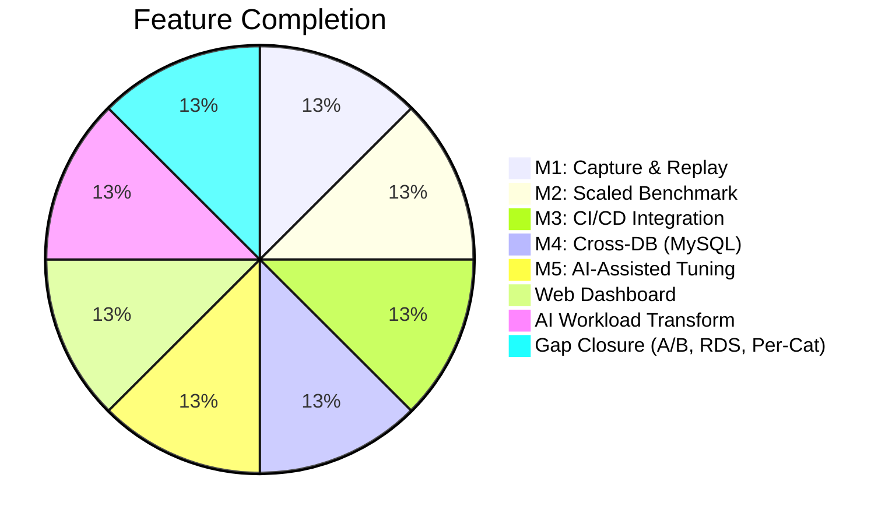
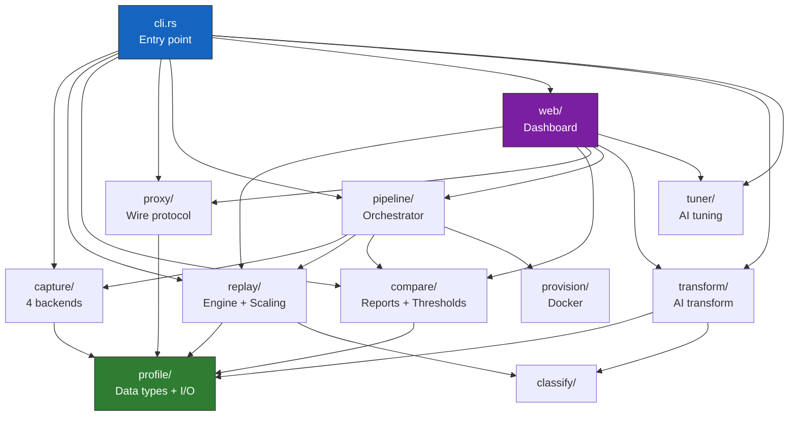

# pg-retest: Current State Assessment

*Last updated: 2026-03-18*

---

## Project Summary

**pg-retest** (v0.2.0) is a mature PostgreSQL workload testing and comparison tool written in Rust. All five major milestones plus additional gap closure, web dashboard, and AI-powered features are complete.



---

## Metrics at a Glance

| Metric | Value |
|--------|-------|
| Version | 0.2.0 |
| Language | Rust 2021 edition |
| Source files | 57 |
| Source lines (src/) | ~14,400 |
| Test code (tests/) | ~3,300 lines |
| Integration test files | 20 |
| Unit test modules | 19 |
| **Total tests** | **232** |
| **Test pass rate** | **100%** |
| **Clippy warnings** | **0** |
| TODO/FIXME comments | 0 |
| `#[ignore]` tests | 0 |
| Direct dependencies | 17 crates |
| Total commits | ~157 |
| Subcommands | 11 |

---

## What Works

### Fully Functional (Production-Ready)

| Feature | Status | Tests | Confidence |
|---------|--------|-------|------------|
| PG CSV log capture | Stable | 19 (unit+integration) | High |
| PII masking | Stable | 14 (unit+integration) | High |
| MessagePack profile I/O (v1+v2) | Stable | 9 | High |
| Async parallel replay | Stable | 5 | High |
| Transaction-aware replay | Stable | 5+ | High |
| Read-only replay mode | Stable | 5 | High |
| Speed control | Stable | Built into replay tests | High |
| Workload classification | Stable | 6 | High |
| Performance comparison | Stable | 8 | High |
| Threshold evaluation | Stable | 5 | High |
| JUnit XML output | Stable | 4 | High |
| Session scaling (uniform) | Stable | 6 | High |
| Per-category scaling | Stable | 5 | High |
| A/B variant testing | Stable | 5 | High |
| TOML pipeline config | Stable | 12 (config) + 4 (pipeline) | High |
| MySQL slow log capture | Stable | 14 (parsing + transform) | High |
| MySQL-to-PG SQL transforms | Stable | 16 (unit+integration) | High |
| AWS RDS log capture | Stable | 3 | Medium |
| PG wire protocol proxy | Stable | 17 (protocol+capture) | High |
| Docker provisioner | Functional | 3 | Medium |
| Web dashboard (API) | Functional | 6 | Medium |
| AI workload transform (analyze) | Stable | 9 | High |
| AI workload transform (engine) | Stable | 14 (engine+plan) | High |
| AI workload transform (planner) | Functional | 4 | Medium |
| AI-assisted tuning (safety) | Stable | 5 | High |
| AI-assisted tuning (types/apply) | Stable | 3 | High |
| AI-assisted tuning (advisor) | Functional | 3 | Medium |
| AI-assisted tuning (context) | Functional | 1 | Medium |
| Tuning auto-rollback | Functional | Part of tuner tests | Medium |
| Web dashboard (frontend) | Functional | Manual testing | Low-Medium |

### Confidence Levels Explained

- **High**: Thorough unit + integration tests, stable in multiple scenarios, well-understood edge cases.
- **Medium**: Tests exist but are smoke-level or mock external dependencies (LLM APIs, AWS CLI, Docker, live PG connections). Core logic is tested; integration points are not.
- **Low-Medium**: Works but tested primarily through manual verification. No automated integration tests for the full path.

---

## Test Coverage Breakdown

### Unit Tests (107 total)

```
Unit Tests by Module (107 total)

proxy::protocol  ██████████████ 14
config           ████████████   12
capture::csv_log ███████████    11
transform::analy █████████       9
transform::m2pg  █████████       9
capture::masking ████████        8
web::db          ████████        8
capture::mysql   █████           5
transform::engin █████           5
tuner::safety    █████           5
transform::plann ████            4
proxy::capture   ███             3
provision        ███             3
transform::plan  ███             3
tuner::advisor   ███             3
tuner::types     ██              2
tuner::context   █               1
tuner::apply     █               1
```

| Module | Tests | Coverage Notes |
|--------|-------|----------------|
| `capture::csv_log` | 11 | Duration parsing, parameters, prepared statements, transactions |
| `capture::masking` | 8 | String masking, numeric literals, identifier preservation, edge cases |
| `capture::mysql_slow` | 5 | MySQL log parsing, timestamps, user/host extraction |
| `config` | 12 | TOML parsing, validation, variants, RDS config, edge cases |
| `proxy::protocol` | 14 | PG message parsing, startup, frames, parameter handling |
| `proxy::capture` | 3 | Profile building, masking, transactions |
| `provision` | 3 | Provision, teardown, error handling |
| `transform::analyze` | 9 | Table extraction, Union-Find grouping, filter columns |
| `transform::mysql_to_pg` | 9 | Backticks, LIMIT, IFNULL, IF, UNIX_TIMESTAMP |
| `transform::engine` | 5 | Scaling, injection, removal, determinism |
| `transform::plan` | 3 | TOML/JSON roundtrips |
| `transform::planner` | 4 | Prompt building, tool call parsing, provider config |
| `tuner::advisor` | 3 | System prompt, tool call parsing |
| `tuner::context` | 1 | Slow query extraction |
| `tuner::safety` | 5 | Safe params, blocked SQL, production hostname check |
| `tuner::apply` | 1 | Index name extraction |
| `tuner::types` | 2 | JSON serialization roundtrips |
| `web::db` | 8 | SQLite CRUD operations, schema init |

### Integration Tests (109 total)

| Test File | Tests | What It Covers |
|-----------|-------|----------------|
| `ab_test.rs` | 5 | A/B comparison, winner determination, threshold detection |
| `capture_csv_test.rs` | 8 | CSV log parsing, transactions, multi-session |
| `classify_test.rs` | 6 | All 4 workload classes + mixed scenarios |
| `compare_test.rs` | 8 | Comparison logic, latency diffs, regressions |
| `junit_test.rs` | 4 | JUnit XML formatting, escaping |
| `masking_test.rs` | 6 | PII masking in INSERT/UPDATE/complex SQL |
| `mysql_integration_test.rs` | 3 | End-to-end MySQL capture with transform |
| `mysql_slow_test.rs` | 6 | MySQL slow log parsing, multi-query |
| `mysql_transform_test.rs` | 7 | Full SQL transform pipeline |
| `per_category_scaling_test.rs` | 5 | Per-class scaling, ID monotonicity |
| `pipeline_test.rs` | 4 | Full E2E pipeline with Docker provisioner |
| `profile_io_test.rs` | 9 | MessagePack I/O, v1/v2 compat, roundtrips |
| `rds_capture_test.rs` | 3 | AWS RDS log file parsing (mocked) |
| `replay_test.rs` | 5 | Read-only vs read-write modes |
| `scaling_test.rs` | 6 | Session scaling, stagger, safety warnings |
| `threshold_test.rs` | 5 | Threshold evaluation, pass/fail logic |
| `transform_test.rs` | 9 | Analyzer, planner, engine integration |
| `tuner_test.rs` | 4 | Tuning safety, reporting, config |
| `web_test.rs` | 6 | Web API endpoints, health checks |

---

## What Needs Improvement

### Testing Gaps

```
Test Coverage vs. Risk Matrix

                    ┃ LOW COVERAGE          │ HIGH COVERAGE
━━━━━━━━━━━━━━━━━━━╋━━━━━━━━━━━━━━━━━━━━━━━┿━━━━━━━━━━━━━━━━━━━━━━━━
  HIGH RISK         ┃ ⚠ NEEDS ATTENTION     │ ✅ WELL PROTECTED
  (core features,   ┃                       │
   data integrity)  ┃ • LLM Integration     │ • CSV Log Parser
                    ┃ • Tuner Context       │ • PII Masking
                    ┃                       │ • Profile I/O
                    ┃                       │ • Comparison
                    ┃                       │ • Replay Engine E2E ✓
                    ┃                       │ • Proxy Relay E2E ✓
────────────────────╂───────────────────────┼────────────────────────
  LOW RISK          ┃ 💤 LOW PRIORITY       │ ✅ ACCEPTABLE
  (UI, tooling,     ┃                       │
   non-critical)    ┃ • Web Frontend        │ • Classification
                    ┃ • Docker Provisioner  │ • Threshold
                    ┃ • Web Endpoints       │ • Transform Engine
                    ┃                       │ • Scaling
```

| Gap | Impact | Effort | Priority |
|-----|--------|--------|----------|
| ~~**Replay engine E2E tests**~~ | ~~High~~ | ~~Medium~~ | **Done** -- 10 E2E tests against real PG (basic SELECT, DML, transactions, auto-rollback, parallel sessions, speed control, error handling) |
| ~~**Proxy relay E2E tests**~~ | ~~High~~ | ~~High~~ | **Done** -- 6 E2E tests (basic relay, SQL capture, PII masking, 5 concurrent clients, no-capture mode, duration auto-shutdown) |
| **LLM advisor integration tests** | Medium -- API calls are mocked, no real LLM validation | Low -- mock server or record/replay | Medium |
| **Web endpoint deep tests** | Medium -- only smoke tests, no error path coverage | Medium | Medium |
| **Web frontend tests** | Low-Medium -- no browser automation | High -- needs Playwright/Cypress | Low |
| **Tuner context introspection** | Medium -- only 1 test, PG introspection is complex | Medium -- needs test PG with extensions | Medium |
| **High-concurrency stress tests** | Medium -- untested at 1000+ connections | Medium | Medium |
| **Docker provisioner E2E** | Low -- works but only tested with mocked docker | Low | Low |

### Code Quality Items

| Item | Details | Severity |
|------|---------|----------|
| `unwrap()` in production code | ~30 calls outside test code, mostly in initialization/infallible paths | Low -- no dangerous unwraps in I/O paths |
| SQL transform coverage | Regex-based, ~80-90% of real MySQL queries | Acceptable -- documented limitation |
| EXPLAIN limitations | Skips parameterized queries ($1, $2) | Acceptable -- by design |
| No CI/CD pipeline | No `.github/workflows/` -- tests run locally only | Medium -- should add for PRs |

### Missing Features / Future Work

| Feature | Description | Value |
|---------|-------------|-------|
| **GitHub Actions CI** | Automated `cargo test` + `cargo clippy` on PRs | High |
| **Oracle/SQL Server capture** | M4 only covers MySQL; Oracle and SQL Server are in the roadmap | High |
| **Performance benchmarks** | Automated overhead measurement (target <10% for proxy) | Medium |
| **Distributed replay** | Design doc exists (`distributed-replay-design.md`) but not implemented | Medium |
| **SQL Gateway** | Evolution of proxy into a full SQL gateway (design doc exists) | Future |
| **Structured logging** | Currently uses `tracing` but could add structured JSON output | Low |
| **Distributed tracing** | End-to-end pipeline observability | Low |
| **crates.io publish** | Package for Rust ecosystem distribution | Medium |
| **Docker image** | Pre-built Docker image for easy deployment | Medium |
| **Helm chart** | Kubernetes deployment support | Low |

---

## Architecture Health

### Dependency Profile

| Category | Crates | Notes |
|----------|--------|-------|
| Async runtime | tokio, tokio-util, futures-util | Well-maintained, industry standard |
| PG client | tokio-postgres | Mature, async-native |
| Serialization | serde, serde_json, rmp-serde, toml | Standard Rust ecosystem |
| Web | axum, tower-http, rust-embed | Modern, lightweight |
| Database | rusqlite (bundled) | Self-contained, no system SQLite needed |
| CLI | clap (derive) | Industry standard |
| HTTP client | reqwest | For LLM API calls |
| Error handling | anyhow, thiserror | Standard pattern |

No outdated or unmaintained dependencies. All crates are actively developed.

### Error Handling Assessment

- **External I/O**: Proper `Result<T>` propagation via `anyhow::Result`
- **User input**: Validated at CLI and config parsing boundaries
- **LLM API calls**: Timeout handling (120s tuner, 30-60s transform)
- **Database connections**: Connection errors surfaced properly
- **Test code**: `unwrap()` is acceptable and expected
- **Production code**: ~30 `unwrap()` calls, all in initialization or infallible paths

### Modularity Score

The codebase is well-modularized with clear boundaries:



---

## Production Readiness Summary

### Ready Now

- Core capture/replay/compare workflow
- All capture backends (PG CSV, proxy, MySQL, RDS)
- CI/CD pipeline with thresholds and JUnit
- A/B variant testing
- PII masking
- Workload classification and per-category scaling
- AI workload transform (analyze/plan/apply)
- AI-assisted tuning with safety guardrails
- Web dashboard for non-CLI users

### Recommended Before Production Use

1. **Add CI** -- GitHub Actions running `cargo test` + `cargo clippy` on every PR
2. **Replay E2E tests** -- Test against a real PostgreSQL instance (Docker in CI)
3. **Proxy E2E tests** -- Full client-proxy-server relay test
4. **Performance benchmarks** -- Establish and enforce overhead targets
5. **Release binaries** -- GitHub Releases with pre-built binaries for Linux/macOS

### Recommended for Scale

1. High-concurrency stress tests (1000+ sessions)
2. Distributed replay for large workloads
3. Structured logging for production observability
4. Docker image / Helm chart for cloud deployments
